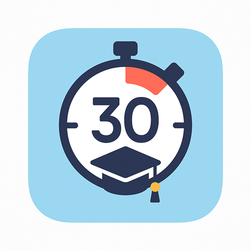

# Hwaiting - 國中教育會考倒數計時器

<div align="center">
  
  <h3>為台灣國中生打造的會考倒數計時應用程式</h3>
</div>

## 📱 應用介紹

Hwaiting（加油）是一款專為台灣國中學生設計的會考倒數計時應用程式，透過精確的倒數計時和桌面小工具功能，幫助學生更好地掌握備考時間，以積極正向的心態迎接國中教育會考。

本應用提供精確到秒的倒數計時，並通過桌面小工具讓學生無需開啟應用即可隨時掌握剩餘時間，提高備考效率和時間管理能力。

## ✨ 主要功能

- **高精度倒數計時**：精確計算距離會考還有多少年、月、日、時、分、秒
- **自訂會考年份**：支援自由選擇未來會考年份（113年及以後）
- **桌面小工具**：直接在手機桌面上顯示倒數時間，無需開啟應用
- **小工具自動更新**：每10秒自動更新一次，確保時間準確
- **應用與小工具同步**：在應用中修改年份後，小工具會立即更新
- **鼓勵提示**：根據剩餘時間提供不同的鼓勵話語
- **深色模式支援**：符合Android Material Design 3設計規範

## 📸 應用截圖

<div align="center">
  <table>
    <tr>
      <td align="center"><b>主頁面</b></td>
      <td align="center"><b>桌面小工具</b></td>
    </tr>
    <tr>
      <td></td>
      <td></td>
    </tr>
  </table>
</div>

## 🔧 技術架構

- **前端技術**：Flutter Framework
- **程式語言**：Dart & Kotlin
- **設計風格**：Material Design 3
- **小工具實現**：Home Widget 套件 + Android App Widget
- **資料儲存**：SharedPreferences
- **平台支援**：Android 5.0+

## ⚙️ 系統要求

- Android 5.0 (API Level 21) 或更高版本
- 至少 50MB 可用儲存空間
- 支援桌面小工具功能

## 📥 安裝方式

### 方法一：直接下載 APK
1. 前往 [Releases](https://github.com/您的用戶名/Hwaiting/releases) 頁面
2. 下載最新版本的 APK 檔案
3. 在Android裝置上安裝（可能需要允許「未知來源」應用安裝權限）

### 方法二：從原始碼構建
1. 確保已安裝 [Flutter SDK](https://flutter.dev/docs/get-started/install)
2. 複製此專案
   ```bash
   git clone https://github.com/您的用戶名/Hwaiting.git
   ```
3. 進入專案目錄
   ```bash
   cd Hwaiting
   ```
4. 獲取依賴
   ```bash
   flutter pub get
   ```
5. 構建應用（Debug 版）
   ```bash
   flutter build apk --debug
   ```
   或（Release 版）
   ```bash
   flutter build apk --release
   ```
6. APK 檔案將位於 `build/app/outputs/flutter-apk/` 目錄

## 🔄 桌面小工具使用指南

1. **安裝應用**：首先安裝並至少運行一次應用程式
2. **新增小工具**：
   - 長按手機桌面空白處
   - 選擇「小工具」或「Widgets」選項
   - 找到「Hwaiting 會考倒數」小工具
   - 長按並拖曳至桌面合適位置
3. **同步設定**：
   - 開啟應用後修改會考年份
   - 小工具將自動更新倒數時間
4. **手動更新**：點擊小工具可立即刷新數據

## 🛠️ 開發指南

### 專案結構
```
lib/
├── main.dart              # 應用程式入口
├── screens/               # 畫面
│   └── countdown_screen.dart  # 主倒數計時畫面
├── utils/                 # 工具類
│   ├── exam_date_calculator.dart  # 日期計算邏輯
│   └── widget_service.dart  # 小工具服務
└── widgets/               # UI元件
    └── exam_countdown_card.dart  # 倒數計時卡片

android/
├── app/src/main/
│   ├── kotlin/com/hwaiting/  # 原生Android代碼
│   │   ├── MainActivity.kt
│   │   └── ExamCountdownWidget.kt  # 小工具實現
│   └── res/
│       ├── drawable/  # 圖示和背景
│       ├── layout/    # 小工具佈局
│       └── xml/       # 小工具配置
```

### 關鍵技術點
- **時間計算**：使用 Dart 的 DateTime 處理複雜的日期差計算
- **小工具通訊**：透過 Home Widget 套件實現 Flutter 與原生小工具間的數據交換
- **定時更新**：使用定時器確保小工具數據定期更新
- **響應式UI**：採用 Flutter 的響應式設計保證不同螢幕尺寸的適配性

## 🧩 未來規劃

- [ ] 多種小工具佈局樣式
- [ ] 會考科目倒數（各科衝刺倒計時）
- [ ] 重要日期標記與提醒
- [ ] iOS平台支援
- [ ] 學習計畫制定與追蹤功能
- [ ] 會考相關資訊整合

## 🤝 貢獻指南

我們歡迎任何形式的貢獻，無論是新功能、錯誤修復還是文檔改進：

1. Fork 此倉庫
2. 創建您的功能分支 (`git checkout -b feature/amazing-feature`)
3. 提交您的更改 (`git commit -m '添加一些驚人的功能'`)
4. 推送到分支 (`git push origin feature/amazing-feature`)
5. 開啟一個 Pull Request

## 📝 版本歷史

- **v1.0.0** (2024/06/xx)
  - 首次發布
  - 基本倒數計時功能
  - 桌面小工具支援

## 📄 授權協議

本專案採用 MIT 授權協議 - 詳見 [LICENSE](LICENSE) 文件

## 👨‍💻 開發者

- 開發者：[您的姓名/暱稱]
- Email：[您的電子郵件]
- GitHub：[@您的GitHub用戶名](https://github.com/您的GitHub用戶名)

---

<div align="center">
  <sub>以積極態度迎接會考挑戰 - Hwaiting! 加油!</sub>
</div>
